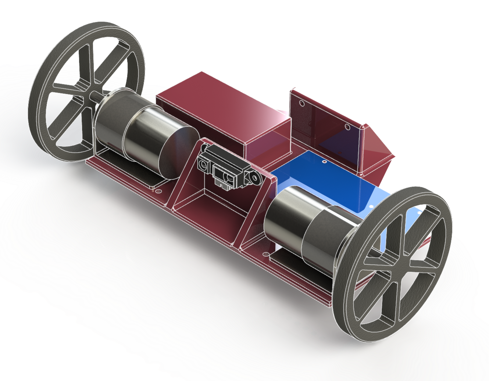

# Mechatronics **MEEN 667** Final Project Repository

This repository contains the code, CAD drawings, report, and presentation from our mechatronics project.

## Control Design

Our proposed project was to design a robot which would maintain a distance between itself and an object with a tunable second-order dynamic response.

The development of the controller can be found in the jupyter-notebooks folder, in the notebook called 'controller_design.jpynb'

The final Arduino sketch is provided in the 'arduino' folder.

## CAD Files

This repository includes the CAD files for the 3D printed chassis that is shown in red above. The SolidWorks file and drawings are in the 'CAD' folder.